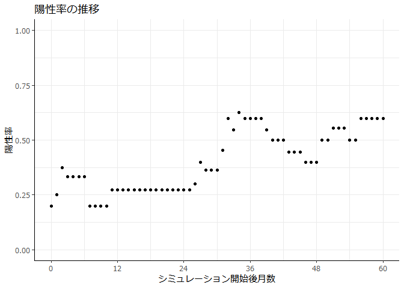
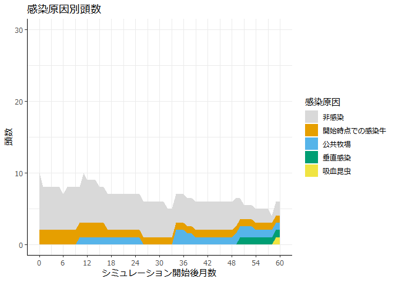

<!-- README.md is generated from README.Rmd. Please edit that file -->

# blvibmjp

<!-- badges: start -->

<!-- badges: end -->

<!--
## Installation

You can install the released version of blvibmjp from [CRAN](https://CRAN.R-project.org) with:

``` r
install.packages("blvibmjp")
```
-->

牛白血病ウイルス（BLV）の農場内での感染の広がり方をシミュレーションするパッケージです。

## Installation

R、RStudioおよびRtoolsをインストールしていない場合、まずそちらをインストールする。  
インストール方法参考：

  - [RおよびRStudioのインストール方法(Mac/Windows) -
    Qiita](https://qiita.com/daifuku_mochi2/items/ad0b398e6affd0688c97)
  - [Rtoolsのインストール](https://k-metrics.github.io/cabinet/env_install_tls.html)

次に、RStudioで次のコードを実行することで、このパッケージをインストールする。

``` r
# 初回のみ
install.packages("remotes")
remotes::install_github("fmsan51/blvibmjp")
```

## Example

1.  以下のコードを実行すると、フォルダ名が表示される。

<!-- end list -->

``` r
file.path(.libPaths()[1], "blvibmjp")
```

2.  フォルダ内の input.xlsx を適当な場所にコピーして、牛・牛舎・移動などのデータを入力する。  
    （とりあえず適当なデータでシミュレーションを試したい、という場合は同フォルダ内のテスト用データ（input\_test.xlsx）を使ってみてください。）

3.  以下のようなコードを実行する。

<!-- end list -->

``` r
# パッケージの読み込み
library(blvibmjp)

# シミュレーションの設定
param$simulation_length <- 60  # シミュレーション期間の長さ（月）
param$n_simulation <- 3  # シミュレーション回数
param$output_dir <- "result"  # シミュレーション結果の保存フォルダ

# 対策の設定
param$control_insects <- 0.5  # 吸血昆虫対策を行っている場合、対策により吸血昆虫がどれだけ減少するか（0.5＝50%減）
param$change_gloves <- TRUE  # 直検手袋を毎回交換するか（TRUE/FALSE）
param$feed_raw_colostrum <- FALSE  # 凍結・加温処理していない初乳を子牛に与えているか
# 他、詳細は help("param") 参照
```

``` r
# データの入力
data <- prepare_data(
  "C:\\Users\\xxx\\Desktop\\input.xlsx",  # データを入力したファイルの場所
  param)
```

``` r
# シミュレーションの実行（1回ごとに十数秒～数分）
simulate_blv_spread(data, param)
```

4.  以下のコードで表示されるフォルダ内に、シミュレーション結果（simulationXX.csv）が保存される。

<!-- end list -->

``` r
output <- file.path(getwd(), param$output_dir)
output
```

5.  シミュレーション結果をグラフ・表にする。

<!-- end list -->

``` r
plot_prev(param, language = "Japanese")  # 陽性率の推移
```



``` r
plot_route(param, language = "Japanese")  # 感染原因別頭数
```



``` r
calc_prev(param, type = "prop")  # 月ごとの感染率
#>     i_month prevalence
#>  1:       0  0.2000000
#>  2:       1  0.2500000
#>  3:       2  0.3750000
#>  4:       3  0.3333333
#>  5:       4  0.3333333
#>  6:       5  0.3333333
#>  7:       6  0.3333333
#>  8:       7  0.2000000
#>  9:       8  0.2000000
#> 10:       9  0.2000000
#> 11:      10  0.2000000
#> 12:      11  0.2727273
#> 13:      12  0.2727273
#> 14:      13  0.2727273
#> 15:      14  0.2727273
#> 16:      15  0.2727273
#> 17:      16  0.2727273
#> 18:      17  0.2727273
#> 19:      18  0.2727273
#> 20:      19  0.2727273
#> 21:      20  0.2727273
#> 22:      21  0.2727273
#> 23:      22  0.2727273
#> 24:      23  0.2727273
#> 25:      24  0.2727273
#> 26:      25  0.2727273
#> 27:      26  0.3000000
#> 28:      27  0.4000000
#> 29:      28  0.3636364
#> 30:      29  0.3636364
#> 31:      30  0.3636364
#> 32:      31  0.4545455
#> 33:      32  0.6000000
#> 34:      33  0.5454545
#> 35:      34  0.6250000
#> 36:      35  0.6000000
#> 37:      36  0.6000000
#> 38:      37  0.6000000
#> 39:      38  0.6000000
#> 40:      39  0.5454545
#> 41:      40  0.5000000
#> 42:      41  0.5000000
#> 43:      42  0.5000000
#> 44:      43  0.4444444
#> 45:      44  0.4444444
#> 46:      45  0.4444444
#> 47:      46  0.4000000
#> 48:      47  0.4000000
#> 49:      48  0.4000000
#> 50:      49  0.5000000
#> 51:      50  0.5000000
#> 52:      51  0.5555556
#> 53:      52  0.5555556
#> 54:      53  0.5555556
#> 55:      54  0.5000000
#> 56:      55  0.5000000
#> 57:      56  0.6000000
#> 58:      57  0.6000000
#> 59:      58  0.6000000
#> 60:      59  0.6000000
#> 61:      60  0.6000000
#>     i_month prevalence
print(calc_prev(param, type = "count"), n = Inf)  # 月ごとの感染牛頭数
#>     i_month   inf noinf
#>       <int> <num> <num>
#>  1:       0     2     8
#>  2:       1     2     6
#>  3:       2     3     5
#>  4:       3     3     6
#>  5:       4     3     6
#>  6:       5     3     6
#>  7:       6     3     6
#>  8:       7     2     7
#>  9:       8     2     7
#> 10:       9     2     7
#> 11:      10     2     7
#> 12:      11     3     8
#> 13:      12     3     8
#> 14:      13     3     8
#> 15:      14     3     8
#> 16:      15     3     8
#> 17:      16     3     8
#> 18:      17     3     8
#> 19:      18     3     8
#> 20:      19     3     8
#> 21:      20     3     8
#> 22:      21     3     8
#> 23:      22     3     8
#> 24:      23     3     8
#> 25:      24     3     8
#> 26:      25     3     8
#> 27:      26     3     7
#> 28:      27     4     6
#> 29:      28     4     7
#> 30:      29     4     7
#> 31:      30     4     7
#> 32:      31     5     6
#> 33:      32     5     4
#> 34:      33     5     5
#> 35:      34     5     4
#> 36:      35     5     4
#> 37:      36     5     4
#> 38:      37     5     4
#> 39:      38     5     4
#> 40:      39     5     5
#> 41:      40     5     5
#> 42:      41     5     5
#> 43:      42     5     5
#> 44:      43     4     5
#> 45:      44     4     5
#> 46:      45     4     5
#> 47:      46     4     6
#> 48:      47     4     6
#> 49:      48     4     6
#> 50:      49     4     4
#> 51:      50     4     4
#> 52:      51     5     4
#> 53:      52     5     4
#> 54:      53     5     4
#> 55:      54     4     4
#> 56:      55     4     4
#> 57:      56     5     4
#> 58:      57     6     4
#> 59:      58     6     4
#> 60:      59     6     4
#> 61:      60     6     4
#>     i_month   inf noinf
print(calc_prev(param, type = "status"), n = Inf)  # 月ごとの感染ステージ別頭数（s=非感染、ial=感染・無症状、ipl=持続性リンパ球増多症、ebl=地方病性牛白血病）
#>     i_month     s   ial   ipl   ebl
#>       <int> <num> <num> <num> <num>
#>  1:       0     8     2     0     0
#>  2:       1     6     2     0     0
#>  3:       2     5     3     0     0
#>  4:       3     6     3     0     0
#>  5:       4     6     3     0     0
#>  6:       5     6     3     0     0
#>  7:       6     6     3     0     0
#>  8:       7     7     2     0     0
#>  9:       8     7     2     0     0
#> 10:       9     7     2     0     0
#> 11:      10     7     2     0     0
#> 12:      11     8     3     0     0
#> 13:      12     8     3     0     0
#> 14:      13     8     3     0     0
#> 15:      14     8     3     0     0
#> 16:      15     8     3     0     0
#> 17:      16     8     3     0     0
#> 18:      17     8     3     0     0
#> 19:      18     8     3     0     0
#> 20:      19     8     3     0     0
#> 21:      20     8     3     0     0
#> 22:      21     8     3     0     0
#> 23:      22     8     3     0     0
#> 24:      23     8     3     0     0
#> 25:      24     8     3     0     0
#> 26:      25     8     3     0     0
#> 27:      26     7     3     0     0
#> 28:      27     6     4     0     0
#> 29:      28     7     4     0     0
#> 30:      29     7     4     0     0
#> 31:      30     7     4     0     0
#> 32:      31     6     5     0     0
#> 33:      32     4     5     0     0
#> 34:      33     5     5     0     0
#> 35:      34     4     5     0     0
#> 36:      35     4     5     0     0
#> 37:      36     4     5     0     0
#> 38:      37     4     5     0     0
#> 39:      38     4     5     0     0
#> 40:      39     5     5     0     0
#> 41:      40     5     5     0     0
#> 42:      41     5     5     0     0
#> 43:      42     5     5     0     0
#> 44:      43     5     4     0     0
#> 45:      44     5     4     0     0
#> 46:      45     5     4     0     0
#> 47:      46     6     4     0     0
#> 48:      47     6     4     0     0
#> 49:      48     6     4     0     0
#> 50:      49     4     4     0     0
#> 51:      50     4     4     0     0
#> 52:      51     4     5     0     0
#> 53:      52     4     5     0     0
#> 54:      53     4     5     0     0
#> 55:      54     4     4     0     0
#> 56:      55     4     4     0     0
#> 57:      56     4     5     0     0
#> 58:      57     4     6     0     0
#> 59:      58     4     6     0     0
#> 60:      59     4     6     0     0
#> 61:      60     4     6     0     0
#>     i_month     s   ial   ipl   ebl
```

``` r
write.csv(calc_prev(param, type = "prop"), file.path(output, "prev.csv"))  # 表をcsvに保存（保存場所は 4. で表示されたフォルダ）
```
